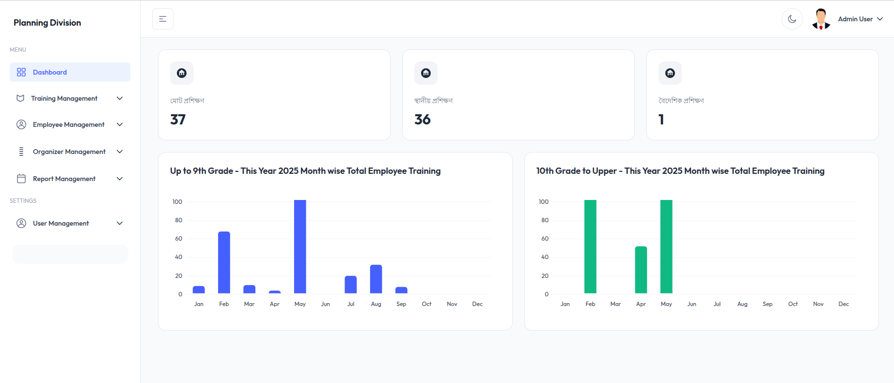

# PM Training Management Frontend

A comprehensive training management system for the Bangladesh Planning Ministry, built with Vue.js 3, TypeScript, and Tailwind CSS. This frontend application provides a modern, responsive dashboard for managing employee training programs, assignments, and reports.



## Project Overview

The PM Training Management System is designed specifically for the Bangladesh Planning Ministry to efficiently manage employee training programs. The system enables administrators to track employee training assignments, generate comprehensive reports, and manage training resources with role-based access control.

### Key Features

🏢 **Employee Management**
- Add and manage employees with designation grades (1-29)
- Track employee training history and progress
- Support for multiple training assignments per employee
- Grade-based categorization and filtering

📚 **Training Program Management**
- Comprehensive training catalog with local and foreign programs
- Training organizer management and assignment
- Group training session management with start/end dates
- Training assignment tracking and monitoring

📊 **Advanced Reporting**
- Grade-wise employee training reports
- Monthly training statistics and analytics
- Individual employee training history
- Export functionality for training reports

👥 **Role-Based Access Control**
- **Admin**: Full system access with all permissions
- **Officer**: View and manage training assignments
- **Operator**: Create and update training records
- Secure authentication with JWT tokens

📈 **Dashboard & Analytics**
- Real-time training statistics
- Monthly training charts by grade levels
- Visual representation of training data
- Responsive design for all devices

## Technology Stack

### Frontend
- **Vue.js 3** - Progressive JavaScript framework with Composition API
- **TypeScript** - Type-safe development
- **Tailwind CSS** - Utility-first CSS framework
- **Vite** - Fast build tool and development server
- **Vue Router 4** - Client-side routing
- **Pinia** - State management
- **ApexCharts** - Data visualization and charting
- **Axios** - HTTP client for API communication

### Backend Integration
- RESTful API integration with Laravel backend
- JWT-based authentication
- Real-time data synchronization
- File upload and management

## Quick Links

- [🔗 GitHub Repository](https://github.com/rifatcse09/pm-training-management-frontend)
- [📄 API Documentation](https://api.pm-training.gov.bd/docs)
- [🖌️ Design System](https://tailwindcss.com/)

## Installation & Setup

### Prerequisites

- Node.js 18.x or later (recommended Node.js 20.x)
- npm or yarn package manager
- Access to the PM Training Management backend API

### Installation Steps

1. **Clone the repository:**
   ```bash
   git clone https://github.com/rifatcse09/pm-training-management-frontend.git
   cd pm-training-management-frontend
   ```

2. **Install dependencies:**
   ```bash
   npm install
   # or
   yarn install
   ```

3. **Environment Configuration:**
   ```bash
   cp .env.example .env.local
   ```
   Update the `.env.local` file with your API endpoints and configuration.

4. **Start development server:**
   ```bash
   npm run dev
   # or
   yarn dev
   ```

5. **Build for production:**
   ```bash
   npm run build
   # or
   yarn build
   ```

## Project Structure

```
src/
├── components/           # Reusable Vue components
│   ├── common/          # Shared components
│   ├── ecommerce/       # Training dashboard components
│   └── layout/          # Layout components
├── views/               # Page components
├── composables/         # Composition API utilities
├── assets/              # Static assets
├── types/               # TypeScript type definitions
└── router/              # Vue Router configuration
```

## Core Features

### Employee Management
- **Add Employee**: Register new employees with personal information and designation
- **Grade Classification**: Automatic categorization based on designation (Grade 1-29 vs Upper Grades)
- **Training History**: Track all training assignments and completions
- **Search & Filter**: Find employees by various criteria

### Training Management
- **Training Catalog**: Maintain comprehensive list of available training programs
- **Organizer Management**: Manage training organizers and institutions
- **Group Training**: Create training sessions with multiple employee assignments
- **Assignment Tracking**: Monitor training progress and completion status

### Reporting System
- **Grade-wise Reports**: Generate reports based on employee grades
- **Individual Reports**: Detailed training history for specific employees
- **Monthly Analytics**: Visual charts showing training trends
- **Export Options**: Download reports in PDF format

### Dashboard Analytics
- **Training Statistics**: Real-time overview of training metrics
- **Monthly Charts**: Visual representation of training data
- **Grade-based Analytics**: Separate charts for different grade levels
- **Progress Tracking**: Monitor training completion rates

## User Roles & Permissions

### Admin
- Full system access
- User management
- System configuration
- All CRUD operations

### Officer
- View training data
- Generate reports
- Monitor training progress
- Read-only access to sensitive data

### Operator
- Create and update training records
- Assign employees to training
- Manage training sessions
- Limited administrative access

## API Integration

The frontend integrates with a Laravel-based backend API that provides:

- **Authentication**: JWT-based secure login
- **Employee API**: CRUD operations for employee management
- **Training API**: Training program and assignment management
- **Reporting API**: Generate and export training reports
- **Dashboard API**: Real-time statistics and analytics

## Development Guidelines

### Code Standards
- TypeScript for type safety
- Vue 3 Composition API
- ESLint and Prettier for code formatting
- Component-based architecture

### State Management
- Pinia for centralized state management
- Reactive data handling
- Persistent authentication state

### Styling
- Tailwind CSS utility classes
- Responsive design principles
- Dark mode support
- Consistent design system

## Contributing

1. Fork the repository
2. Create a feature branch (`git checkout -b feature/amazing-feature`)
3. Commit your changes (`git commit -m 'Add some amazing feature'`)
4. Push to the branch (`git push origin feature/amazing-feature`)
5. Open a Pull Request

## License

This project is proprietary software developed for the Bangladesh Planning Ministry. All rights reserved.

## Support

For technical support or inquiries, please contact:
- **Development Team**: hello@mdrifatul.info

---

**© 2025 Bangladesh Planning Ministry - Training Management System**
